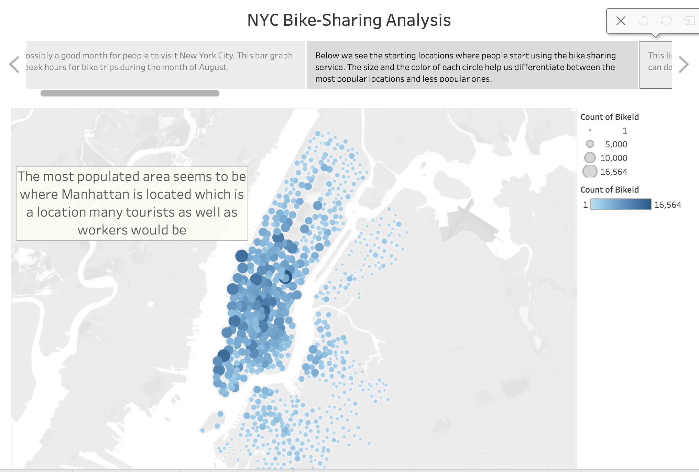
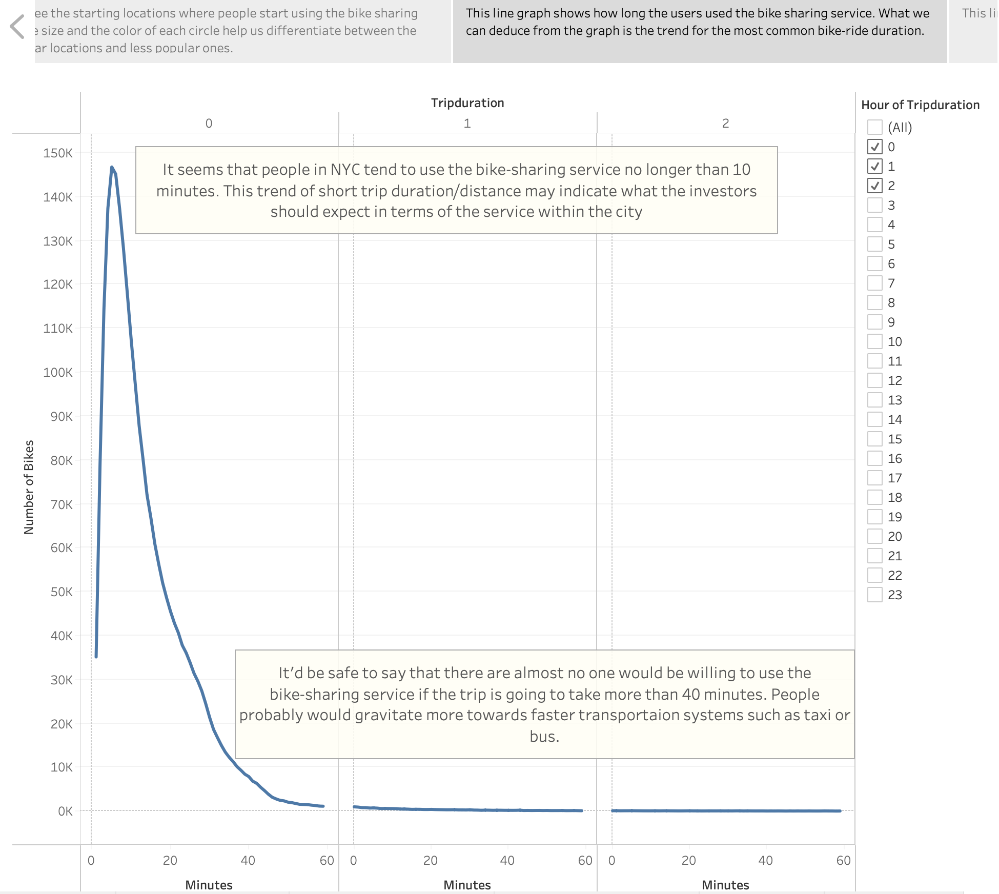
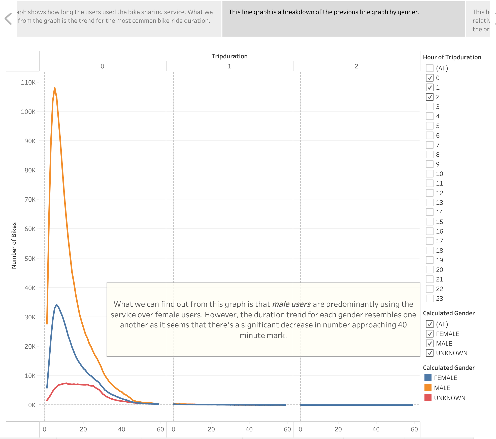
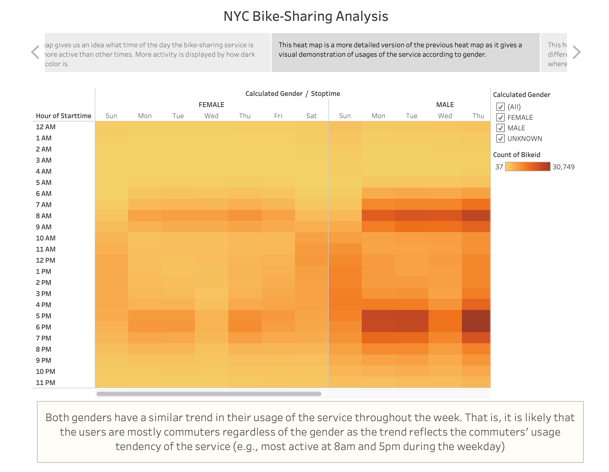
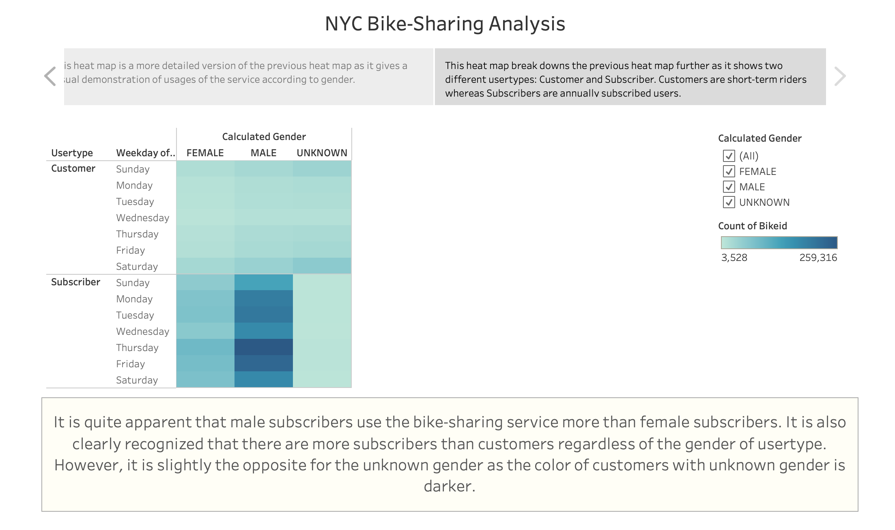

# bikesharing

## Purpose of Analysis

## Results

The link to the [NYC_Bike_Sharing_Dashboard](https://public.tableau.com/views/NYC_Bike_Sharing_Challenge_16455611531760/Bike-SharingAnalysis?:language=en-US&:display_count=n&:origin=viz_share_link)

The visualizations of analysis are as follows:

## Summary