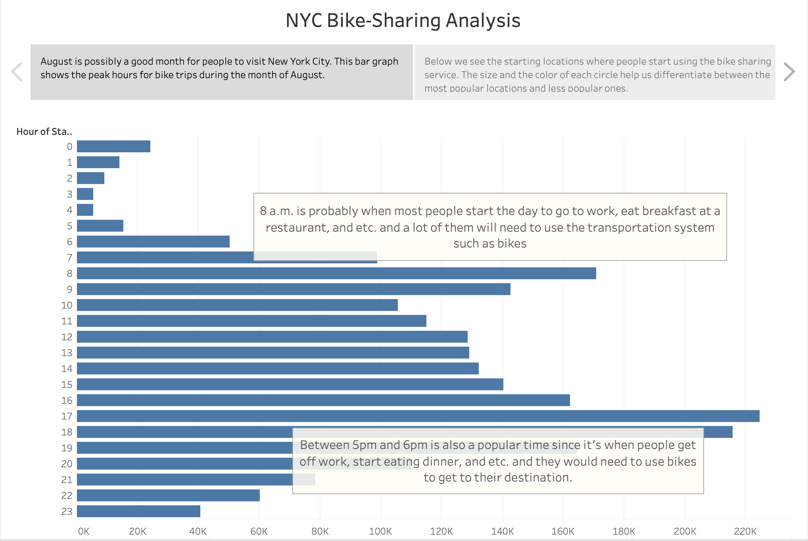
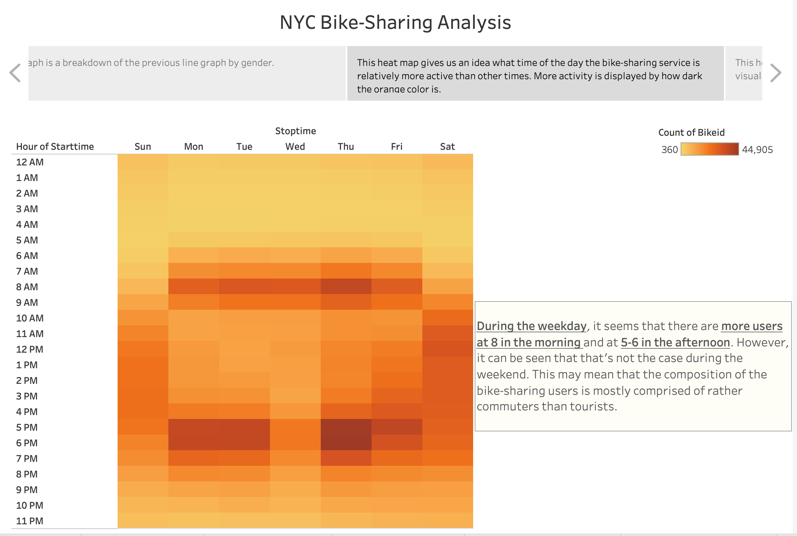

# NYC Bike Sharing Project

## Purpose of Analysis
The goal of this project is to present to the investors a data visualization report of bike-sharing service in NYC so that I can help them strategize their plans of starting the same/similar service in Des Moines, Iowa.  

## Results
I was able to create several graphs from the given dataset that demonstrates bike usage trends. To be more precise, I came up with the following graphs posted below. If you would like to view the wholistic analysis of NYC Bike Sharing on the Tableau webpage, you can click the [link](https://public.tableau.com/views/NYC_Bike_Sharing_Challenge_16455611531760/Bike-SharingAnalysis?:language=en-US&:display_count=n&:origin=viz_share_link).

The visualizations of analysis are as follows:
### 1. Peak Hours in August

### 2. Top Starting Locations

### 3. Trip Duration (All Users)

### 4. Trip Duration (All Users by Gender)

### 5. Trip by Hour during the Week 

### 6. Trip by Hour during the Week (by Gender)

### 7. Trip during the Week (by User type as well as by Gender)

## Summary
The first finding I can report to the investors is about the trip duration trend. It was shown in the 3rd and 4th graph that people in NYC tend to use the service no longer than 10 minutes. This makes sense since in such a crowded city like NYC, everything should be within 10-minute bike trip. However, perhaps this finding may not apply to the targeted city like Des Moines since a lot of places in a suburban city are not too close from each other. Maybe the investors should require analysts to do geospatial analysis on Des Moines to see if it the places in Des Moines people tend to visit within the biking distance. 

Another finding I can report to the investors is about what time of the day people tend to check out bikes the most. As demonstrated in the graphs, people checked out bikes the most at around 8am and 5pm regardless of gender. This is telling of what purpose the bike-sharing service serves: it's rather for the commuters in the city than the tourists. This finding was reinforced with the 7th graph; it was found that there were a lot more subscribers (long-term users) than customers (short-term users). However, similar to the first finding, this finding may not help the investors to make implementation decisions since NYC and Des Moines are different geographically. 
